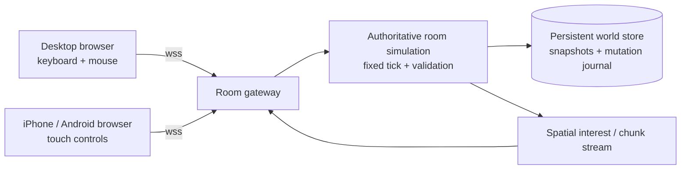

# Multiplayer and mobile architecture

## Goal

Wasteland Commons is a browser game that lets two people share one persistent cooperative world: one may be on desktop and the other on iPhone or Android. The first release is hostless and server-authoritative. A room remains the owner of its world; neither player's device is the host.

## Assumptions and first-release limits

- The client is a TypeScript browser application using Three.js/WebGL.
- The server is a Node.js/TypeScript process using secure WebSockets (`wss`) and a durable SQL store such as PostgreSQL.
- Players join with an anonymous room code or invite link. Accounts, social login, voice chat, public matchmaking, PvP, mods, and cross-region scaling are out of scope for the first release.
- A room has exactly two active player slots. The world simulation pauses when a room has no connected players; the saved world still persists.
- The first release targets a bounded playable region with streamed chunks, not an unlimited seamless wasteland. Entity density, NPC simulation, vehicles, and boss fights are capped by a server budget.
- Mobile play is landscape-first. Menus may work in portrait, but the live game targets current iPhone Safari and Android Chrome with WebGL2, touch input, and a stable 30 FPS tier.
- Multiplayer uses WebSockets rather than peer-to-peer WebRTC. This keeps authority, persistence, and reconnect behavior in one place and works through ordinary mobile NATs.

These limits are deliberate: they make the two-player experience reliable before adding accounts, matchmaking, large rooms, or a continuously simulated world.

## Runtime shape



One room owns one authoritative simulation state in memory. The gateway authenticates the room capability token, routes both connections to that room, and never treats client positions, damage, inventory, construction, or NPC outcomes as truth.

The initial deployment can run all rooms in one process. Keep the room boundary explicit so a later deployment can move each room to a worker or service without changing the client protocol.

## Authoritative simulation

Run the room simulation on a fixed server tick, initially 20 Hz. Render clients independently at 30 FPS on mobile and up to 60 FPS on desktop.

Clients send intent, not results:

```ts
type InputFrame = {
  seq: number;
  clientTime: number;
  move: { x: number; y: number };
  look: { x: number; y: number };
  buttons: number;
};

type ActionCommand = {
  commandId: string;
  kind: "interact" | "attack" | "build" | "enterVehicle" | "pilotMech";
  targetId?: string;
  targetCell?: string;
  payload?: unknown;
};
```

The server checks sequence, rate, permissions, cooldowns, distance, collisions, inventory, build rules, and the current world version before applying a command. Every accepted mutation gets a server tick and a durable journal ID. Repeating a `commandId` is idempotent and cannot duplicate loot, buildings, damage, or items.

The server sends snapshots or deltas containing:

- `roomId`, `worldVersion`, `serverTick`, and the acknowledged input sequence;
- authoritative player transforms and movement state;
- nearby NPCs, robots, creatures, vehicles, projectiles, interactables, and effects;
- changed components for persistent entities;
- reliable gameplay events such as damage, death, construction completion, inventory changes, and quest updates.

Local movement may be predicted from the player's unacknowledged input, then reconciled to the server state. Remote players and NPCs are interpolated between snapshots. Combat, building, inventory, vehicle state, mech parts, and persistence are never client-authoritative.

## Persistent shared world

Use the same deterministic spatial contract for networking and inspection:

- Every world object has a stable `objectId` assigned at creation.
- Every object has a grid/chunk address, bounds, collision proxy, and world version.
- Server commands refer to `targetId` and may include a human-readable grid cell for diagnostics; the server resolves and validates the ID against its current state.
- Chunk coordinates are the interest-management boundary. The server streams entities in the player's current chunk plus a small neighbor radius and unloads distant render state on the client.

The durable store should contain at least:

- `worlds`: room identity, seed, schema version, last saved tick, and last saved world version;
- `world_entities`: stable IDs, chunk, component/state payload, revision, and deletion tombstone;
- `world_mutations`: idempotency key, server tick, actor, mutation type, payload, and applied revision;
- `player_slots`: anonymous player identity, display name, reconnect-token hash, last presence, and world position.

Keep the authoritative state in memory while a room is active. Persist important mutations transactionally, and checkpoint the complete room state on a short interval such as every 5–10 seconds and on clean room shutdown. On restart, load the checkpoint and replay later journal entries. Never reuse an object ID or silently erase a tombstone.

The world is shared by room code, not by a device. Both players therefore see the same built structures, containers, NPC role assignments, vehicle state, and defeated or damaged enemies after reconnecting.

## Room and join flow

1. Player selects **Create room**. The server creates a world seed, a six-character room code, and a short-lived invite URL.
2. The creator receives an opaque reconnect token stored locally by the browser and sees a shareable link such as `/join/AB7KQ2`.
3. The second player opens the link or enters the code. The server validates the room, allocates slot two, and sends a baseline manifest plus the nearby world snapshot.
4. Both clients complete a protocol/version handshake before entering play. A version mismatch produces a readable update message instead of a partially connected room.
5. The room shows presence and connection state, but gameplay is not blocked by a permanent lobby. The creator can start immediately; the second player can join the active world.

Do not put personal names, email addresses, or device identifiers in room URLs. Guest display names are local preferences. Reconnect tokens are random capabilities; store only a hash on the server and provide a visible **Leave/reset this device** action.

## Disconnects and reconnects

- Send heartbeat ping/pong messages and detect a dead connection quickly without treating a brief mobile sleep as data loss.
- Retry with bounded exponential backoff, for example 1, 2, 4, 8, 15, and 30 seconds.
- On `visibilitychange`, `pageshow`, and network-online events, re-open the socket and send the reconnect token plus the last received `serverTick` and `worldVersion`.
- Keep a disconnected player slot and entity for a grace period, initially 120 seconds. Put the player in a safe server-controlled state; do not let a disconnected client continue issuing commands.
- If the journal still covers the gap, send deltas. Otherwise send a fresh room snapshot and nearby chunk state. The client replaces stale render state rather than applying uncertain local changes.
- If a second connection presents the same reconnect token, transfer the slot to the newest connection and close the old socket. Commands from the old connection are rejected.
- If the token is lost, the player may rejoin as a new guest; automatic identity recovery is not promised without an account system.

Mobile Safari may suspend a background tab. Treat this as an expected disconnect, not an error condition, and make the resume/re-sync path a first-class test.

## Input and UX contract

The gameplay actions are device-independent. The input layer maps controls to the same `InputFrame` and `ActionCommand` messages.

Desktop defaults:

- WASD or arrow keys: movement;
- mouse: look/aim with pointer lock;
- mouse buttons: primary/secondary action;
- keyboard prompts for interact, inventory, build, vehicle, and mech controls.

Mobile defaults:

- left virtual stick: movement;
- right-side drag: look/aim;
- context-sensitive interact button;
- compact attack, dodge/sprint, build, inventory, and vehicle/mech buttons;
- optional hold-to-aim and tap-to-interact behavior, with no hover-only information.

Controls must respect safe-area insets, support one-handed menu navigation, use touch targets of roughly 44–48 CSS pixels, and keep important actions reachable without covering the camera. Do not require a physical keyboard, mouse, controller, multitouch precision, or a long text entry session on mobile.

## Mobile performance budget

Use a device tier selected at startup and allow the player to change it later:

- Mobile low: 30 FPS target, capped pixel ratio, shorter view distance, fewer dynamic lights, simplified shadows, reduced NPC/particle density.
- Mobile high: 30 FPS target with higher resolution and effects when sustained; never make high settings a compatibility requirement.
- Desktop: 60 FPS target when available, with the same simulation and content rules.

Implementation rules:

- Cap mobile device pixel ratio around 1.25–1.5 and use dynamic resolution when frame time rises.
- Stream chunk assets and dispose of distant render resources; do not keep the whole wasteland's textures and meshes resident.
- Prefer compressed textures, atlases, instancing, baked/static lighting where possible, pooled effects, and low-cost collision proxies.
- Keep the first playable load small enough for a mobile connection; show progress while later chunks stream. A practical initial target is at most 20 MB compressed for code and core scene data, with optional art streamed afterward.
- Budget the network separately from rendering: snapshots are interest-managed and delta-compressed; unreliable movement snapshots may be dropped, while actions and persistence events are reliable.
- Never tie simulation speed to render FPS or network arrival time.

## Protocol reliability and safety

Use one WebSocket connection per browser tab with message envelopes containing `protocolVersion`, `roomId`, `clientSeq`, `serverTick`, `kind`, and `payload`.

- Reliable commands and events use `commandId`/event IDs and server acknowledgements.
- Frequent input and transform updates may be replaced by newer messages.
- Validate payload size, numeric ranges, command frequency, target distance, and room membership on the server.
- Rate-limit room creation, join attempts, and malformed messages.
- Do not expose database credentials or authoritative simulation code to the browser.
- Use HTTPS/WSS in production; local development may use a documented localhost exception.

## Verification gates

Before calling the multiplayer slice complete, verify on a real or emulated desktop, iPhone Safari, and Android Chrome:

1. Create a room on one device, join with the other, and see both players in the same initial location.
2. Move, look, interact, build one structure, use one shared container, and observe the same result on both devices.
3. Close or background one mobile browser, reconnect it, and confirm it resumes the same player and world without duplicated commands or lost committed mutations.
4. Reload either device and confirm the persistent world, stable object IDs, grid/chunk state, inventory, and construction survive.
5. Run the same actions with poor latency and packet loss; confirm interpolation, reconciliation, reliable actions, and a clear reconnect state.
6. Confirm a mobile session reaches the 30 FPS tier without exhausting memory or downloading the entire map.
7. Use the inspection layer to show the authoritative room tick, player IDs, chunk address, target IDs, connection state, and last persistence revision.

## Delivery sequence

1. Define the protocol types, room lifecycle, anonymous capability tokens, and deterministic tick.
2. Implement create/join plus authoritative two-player movement with desktop and touch input.
3. Add snapshots/deltas, chunk interest management, prediction/reconciliation, and inspection telemetry.
4. Add durable checkpoints, mutation journal, idempotent commands, reload, and mobile resume/reconnect.
5. Add shared interaction/building, then NPCs, robots, vehicles, and mech state behind the same authoritative command model.
6. Tune mobile rendering, network budgets, failure handling, and clean-room restart behavior.

The first release succeeds when two anonymous players can reliably enter the same saved world from desktop, iPhone, and Android, make server-validated changes together, disconnect without corrupting state, and return to the same world later.
