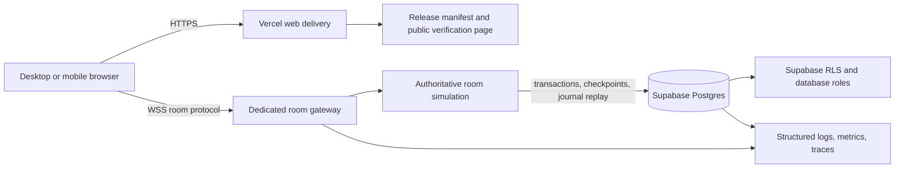

# Wasteland Commons: Production Release Architecture

## Status and scope

This document is the production release contract for the first public release
of Wasteland Commons. It describes how the browser client, dedicated
authoritative multiplayer boundary, durable persistence, delivery, and
verification fit together. It is architecture and operating guidance only: no
cloud services, projects, databases, domains, or deployments are provisioned
by this document.

The first release is a hostless, cooperative browser game for two anonymous
players sharing one persistent world. The world is owned by a room, not by a
device. Accounts, public matchmaking, PvP, voice, mods, unlimited room size,
and a continuously simulated world with no connected players remain outside
this release boundary.

## Release shape at a glance



The browser owns presentation, input mapping, prediction, interpolation, and
local UX state. The dedicated multiplayer boundary owns every shared outcome:
movement validation, collision, combat, inventory, construction, NPC and
vehicle state, stable object identity, and operation ordering. Supabase is the
durable source for saved worlds and the mutation journal; it is not the live
simulation loop. Vercel serves the browser application and immutable release
assets; it is not the WebSocket host.

## Component boundaries

### Browser client

The client is a TypeScript browser application using WebGL2 where available,
with a documented lower-quality fallback for unsupported devices. It must:

- load a release manifest before entering a room;
- advertise protocol, spatial-contract, ruleset, and capability versions;
- translate keyboard, mouse, touch, and optional controller input into the
  shared `InputFrame` and `ActionCommand` contracts;
- render only the authoritative state it has received, with interpolation and
  bounded local prediction for responsiveness;
- keep unsent input and presentation state disposable;
- display connection, resynchronization, version mismatch, and persistence
  status clearly;
- never contain database credentials, server-only secrets, or an authority
  shortcut for a shared mutation.

The client may optimistically animate a swing, movement, or interface action,
but it must wait for the authoritative acknowledgement before treating a
damage result, item, building, vehicle change, mech part, or world revision as
real. A client reload is therefore safe: it reconstructs from the server.

The browser calls the web origin for release metadata and static assets. It
opens one secure WebSocket per active tab to the room gateway. The production
browser may use a public/publishable Supabase key only for explicitly public
metadata if needed; it never writes world state directly through Supabase.

### Dedicated authoritative multiplayer boundary

The room gateway and simulation run in a dedicated long-lived process or
worker environment that supports secure WebSockets and predictable memory and
CPU limits. This boundary is separate from Vercel's request/response web
delivery. The initial deployment may place multiple rooms in one process, but
the room abstraction must remain explicit so rooms can later move to workers
without changing the client protocol.

Each active room has:

- one in-memory authoritative state;
- one fixed simulation tick, initially 20 Hz;
- one ordered command queue;
- one connected-session registry for at most two active player slots;
- one persistence coordinator for transactional mutations and checkpoints;
- one interest-management view based on sectors/chunks;
- one room lifecycle state: `loading`, `active`, `draining`, `idle`, or
  `failed`.

Clients send intent, sequence numbers, expected revisions, and capability
proofs. The server validates room membership, sequence order, rate limits,
cooldowns, distance, permissions, collision/support truth, current entity
revisions, and inventory before applying a command. Accepted operations receive
an operation ID, server tick, world revision, and durable journal ID. Repeated
command IDs are idempotent. Stale operations are rejected with current state
and a readable reason; they are never merged by guesswork.

The authoritative boundary sends a handshake, baseline manifest, interest-
managed snapshots/deltas, reliable gameplay events, and resync instructions.
Frequent movement updates may be replaced by newer updates. Actions,
mutations, acknowledgements, and persistence results are reliable and
idempotent.

The boundary owns the following truth:

| Concern | Authority | Durable requirement |
| --- | --- | --- |
| Camera, effects, input mapping, interpolation | Browser | None |
| Player intent and prediction | Browser, subject to acknowledgement | None |
| Player transform and collision result | Room simulation | Checkpoint/state as applicable |
| Combat, loot, inventory, NPC/robot decisions | Room simulation | Journal every committed mutation |
| Buildings, containers, vehicles, mech parts | Room simulation | Journal plus entity revision |
| Stable object IDs, tombstones, chunk address | Room simulation and spatial contract | Persistent manifest/entity records |
| Saved world recovery | Supabase Postgres | Checkpoint plus journal replay |

## Protocol and version contract

Every WebSocket message has an envelope equivalent to:

```text
protocolVersion
roomId
sessionId
clientSeq
serverTick
kind
payload
```

The initial handshake must include the client build ID, protocol version,
spatial schema version, ruleset version, and supported capabilities. The
server responds with the server build ID, world ID, world revision, manifest
hash, authoritative tick rate, and initial interest sectors. A mismatch must
produce either a compatible snapshot or a readable update-required response;
the client must not silently interpret an incompatible grid, manifest, or
operation schema.

The shared spatial contract remains the identity boundary across desktop,
iPhone, and Android. Stable entity IDs, grid/chunk addresses, revisions,
collision proxies, allowed relationships, tombstones, and operation ordering
are protocol data, not renderer-specific implementation details. Procedural
content may be regenerated from the world seed, but persistent mutations always
override that baseline.

## Supabase durable persistence and RLS

Supabase Postgres is the durable store for room-owned worlds. The simulation
keeps hot state in memory while a room is active and persists important
mutations transactionally. It checkpoints the complete room state on a short
interval such as every 5–10 seconds and on clean shutdown. On recovery it loads
the newest valid checkpoint and replays journal entries after that checkpoint.
The server must not acknowledge a mutation as committed until its required
transaction has succeeded.

The minimum durable model is:

- `worlds`: room/world identity, seed, schema and ruleset versions, last saved
  tick, last saved world revision, and checkpoint metadata;
- `world_entities`: stable object ID, world ID, sector/chunk, component/state
  payload, entity revision, and deletion tombstone;
- `world_mutations`: idempotency key/command ID, operation ID, world ID, server
  tick, actor/session, mutation type, validated payload, result, and applied
  revision;
- `world_checkpoints`: immutable checkpoint references, content hash, tick,
  revision, and creation time;
- `player_slots`: room slot, guest identity, display-name preference,
  reconnect-token hash, last presence, safe position, and expiry;
- `room_sessions`: connection/session lifecycle, build ID, protocol version,
  last acknowledged tick, and disconnect reason.

Use a world/room ID on every tenant-owned row. Never infer tenancy from a room
code, client-provided label, or URL. Foreign keys, uniqueness constraints,
revision checks, idempotency uniqueness, append-only journal rules, and
tombstone preservation are database invariants as well as server checks.

### RLS and database roles

Row-level security is defense in depth around the room boundary:

- The browser has no permission to insert, update, or delete world rows.
- Public release metadata is either static or exposed through a narrowly
  scoped read-only surface; it does not expose guest tokens or world payloads.
- The runtime connects with a server-only credential and a restricted runtime
  database role. Runtime transactions set trusted room and actor context before
  calling persistence functions. Policies require that context to match every
  accessed world row.
- Runtime functions enforce allowed mutation shapes, idempotency, revisions,
  and tombstones. They return only the minimum result needed by the room.
- A separate migration/operator role is not available to the game process and
  is used only for reviewed schema changes or controlled recovery.
- Any emergency administrative bypass is time-limited, audited, and never
  shipped to the browser.

Where Supabase's service-role facilities are used for administration, they are
server-side only and are not treated as a substitute for application
authorization. Production verification must demonstrate that a forged browser
request cannot read another room, mutate a world, replay a command, or extend a
reconnect capability.

### Persistence failure behavior

If a required mutation transaction fails, the room does not advance the
committed world revision. The command receives a retryable or terminal error,
and the room remains in a clearly visible persistence-degraded state. If the
room cannot safely persist, it stops accepting shared mutations, preserves the
last known good state in memory for controlled shutdown, and marks itself
`draining` or `failed`. It must never acknowledge local-only progress as saved.

## Room creation, join, and reconnect

Room codes and invite URLs identify a room; they are not authentication. Each
player receives an opaque random reconnect capability. Only a hash of that
capability is stored server-side. URLs contain no email, personal name, device
identifier, or database key.

### Create and join

1. The browser requests room creation over HTTPS. The gateway creates a world,
   seed, short room code, first slot, and expiring invite capability.
2. The browser stores its reconnect capability locally and receives a join
   URL such as `/join/AB7KQ2`. The gateway starts or loads the room and opens a
   WebSocket after the version handshake.
3. A second browser presents the code or invite capability. The gateway checks
   capacity, rate limits, and room status, allocates slot two, and sends the
   manifest plus the nearby authoritative snapshot.
4. Both clients enter `synchronizing` until the baseline, interest sectors,
   and server acknowledgement are complete. Only then does the UI show active
   shared play.
5. The room remains active while at least one player is connected. If no player
   is connected, the simulation pauses after its safe persistence boundary and
   the saved world remains available for later recovery.

### Disconnect and resume

The client sends heartbeat ping/pong traffic and reconnects after
`visibilitychange`, `pageshow`, and network-online events. It uses bounded
backoff, for example 1, 2, 4, 8, 15, and 30 seconds, and presents a clear
`connecting`, `resyncing`, or `unable to reconnect` state.

The reconnect request includes the capability, client build/protocol versions,
last received server tick, and last known world revision. During the initial
120-second grace period, the server keeps the slot and player entity in a safe
server-controlled state and rejects commands from the disconnected session.
If the journal covers the gap, the server sends ordered deltas; otherwise it
sends a fresh snapshot and nearby manifest/chunk state. The client replaces
uncertain render state instead of replaying it blindly.

If a second connection presents the same capability, the newest connection
transfers the slot and the old session is closed. Old-session commands are
rejected by session ID. Losing a capability permits a new guest join but does
not promise automatic identity recovery until accounts exist. Mobile browser
suspension is an expected disconnect and is a release-critical test case.

## Vercel web delivery

Vercel is the web delivery boundary for the browser application, release
manifest, public documentation, and no-login verification page. The delivery
pipeline should:

- build from a pinned dependency lockfile and a reviewed commit;
- emit immutable, content-hashed JavaScript, CSS, and core asset files;
- serve the release manifest with build ID, commit ID, protocol/schema/ruleset
  versions, asset hashes, and release timestamp;
- provide `/join/<room-code>` as a client-routed entry point that preserves the
  room code without embedding secrets;
- keep preview, staging, and production origins distinct;
- apply HTTPS, secure headers, sensible cache policy, and compression;
- keep source maps private or scrubbed of secrets while retaining a controlled
  upload for error diagnostics;
- prevent a stale HTML shell from selecting an incompatible room protocol.

The WebSocket endpoint is a separate dedicated origin, for example a
configuration-defined `wss` endpoint. The browser obtains that endpoint from
the release configuration, and the gateway validates the requested origin and
build/protocol versions. Vercel functions may be used for small stateless web
concerns only; they must not become an accidental room authority or durable
simulation store.

## Observability and operational evidence

Every room operation carries a correlation set consisting of `roomId`,
`worldId`, `sessionId`, `playerSlot`, `commandId`/`operationId`, `serverTick`,
`worldRevision`, `serverBuildId`, and persistence transaction/checkpoint ID
where applicable. Logs must be structured and must not contain reconnect
capabilities, database credentials, or unnecessary personal data.

Collect:

- gateway connection counts, handshake failures, join denials, reconnect
  success, session replacement, WebSocket close codes, and message rates;
- room tick duration, simulation lag, room count, memory/CPU pressure, command
  validation failures, interest-stream size, and snapshot/resync frequency;
- persistence latency and failures, journal/checkpoint age, replay duration,
  revision gaps, transaction retries, and rooms entering degraded state;
- browser load failures, asset latency, WebGL capability, frame-time tier,
  client-visible disconnects, protocol mismatch, and error boundaries;
- release health by build ID, including error rate and reconnect rate after a
  rollout.

Use traces or linked events to follow one command from browser send through
gateway validation, simulation commit, database transaction, acknowledgement,
and client receipt. Define initial release objectives before launch; sensible
starting examples are no unexplained journal loss, no cross-room data access,
successful reconnect within the grace period under normal transient network
loss, and a bounded percentage of room ticks exceeding their budget. Thresholds
must be tuned from local and staging evidence rather than presented as an
unverified production guarantee.

Alerts should be actionable: persistence failures, increasing tick lag, stale
checkpoints, elevated resyncs, WebSocket handshake failures, asset failures,
and cross-origin/configuration errors. A release is not healthy merely because
the landing page returns HTTP 200; a two-client room must complete a committed
mutation and reconnect test.

## CC0 and public verification

The project defaults to CC0 for project-created source, documentation, data,
and assets unless a specific file records a different license. Third-party or
generated material remains subject to its own license and provenance record; it
must not be relabeled CC0 without permission. Public verification is part of
the release, not a private claim.

The public, no-login surface should expose:

- the playable web entry point and a phone-sized layout check;
- release build ID, commit ID, protocol/schema/ruleset versions, and asset
  manifest hash;
- license and provenance links, including the CC0 dedication where applicable;
- a short architecture/authority explanation and the current release status;
- a safe inspection view that can show room tick, world revision, entity ID,
  chunk/sector, connection state, and persistence revision without exposing
  secrets or another room's private capability;
- reproducible verification instructions for the public build, including the
  exact URL and expected manifest values.

Verification evidence should include a clean-room browser run on desktop,
iPhone Safari or equivalent mobile coverage, and Android Chrome or equivalent
coverage. It should prove create/join, shared movement, one committed
interaction or construction mutation, reload persistence, mobile background /
resume, stale-command rejection, and room isolation. Network degradation and
the no-player pause/reload path must also be tested.

Reference repositories may inform principles such as authoritative ownership,
deterministic identity, and durable journaling. Their branding, layout,
content identity, and code are not part of this release and must not be copied.

## Local-first testing versus production

Local-first development is an intentional fidelity boundary, not a second
product mode. Local tests should use the same protocol types, room state
machine, persistence adapter interface, idempotency rules, and versioned
handshake as production.

| Concern | Local-first test boundary | Production boundary |
| --- | --- | --- |
| Web delivery | Local dev server and explicit localhost URL | Vercel HTTPS origin with immutable release assets |
| Multiplayer | Loopback WSS/WS gateway with deterministic fake clock where useful | Dedicated TLS WebSocket gateway and long-lived room process |
| Persistence | In-memory adapter for unit tests; local Postgres/Supabase-compatible integration for recovery tests | Supabase Postgres with reviewed schema, migrations, checkpoints, journal, and RLS |
| Secrets | Test-only values and documented local exception | Secret manager/environment bindings; never bundled into client assets |
| Rooms | Deterministic seeds, two simulated clients, fault injection | Anonymous capability rooms, rate limits, capacity, safe pause, and operational limits |
| Time/network | Fake tick, latency, packet loss, browser sleep/resume simulation | Real clock, TLS, mobile networks, reconnect grace period, and monitoring |
| Data safety | Disposable fixtures and resettable test database | Backups, retention, checkpoint integrity, migration rollback plan, and audited access |

Local mode may bypass TLS or use an in-memory store only when the boundary is
explicit in configuration and visible in the UI/logs. It must not silently
change authority rules or let a client commit state that production would
reject. Production must fail closed when required configuration, persistence,
or protocol compatibility is missing; it must not fall back to local memory.

Before release, run the same scenario matrix in three layers:

1. deterministic unit/property tests for commands, revisions, idempotency,
   spatial validation, tombstones, and reconnect state transitions;
2. local integration tests with two clients, persistence restart, packet loss,
   and forced browser suspension;
3. production-like staging tests using the deployed web artifact, dedicated
   gateway, Supabase RLS, TLS, and real mobile browsers.

## Release sequence and gates

1. **Contract freeze:** review protocol, spatial schema, ruleset, database
   migrations, release manifest fields, and compatibility policy.
2. **Build:** create a clean artifact from the reviewed commit; record hashes,
   build ID, dependency lockfile, and source/provenance inventory.
3. **Persistence check:** apply migrations in an isolated environment, test
   RLS and runtime-role permissions, restore a checkpoint, replay the journal,
   and verify tombstones and revisions.
4. **Server check:** run two-client authoritative tests, stale-command and
   duplicate-command tests, room isolation, graceful drain, crash/restart
   recovery, and reconnect within the grace period.
5. **Browser check:** serve the exact release artifact, test desktop plus
   mobile-sized clients, verify WebGL fallback and frame/network budgets, and
   confirm that `/join/<code>` loads the matching release.
6. **Observability check:** confirm correlation fields, dashboards, alerts,
   error reporting, and absence of capabilities/secrets in logs and client
   bundles.
7. **Public verification check:** confirm the no-login page, exact public URL,
   CC0/provenance information, release manifest, inspection data, and license
   evidence.
8. **Progressive release:** expose the production web artifact, admit a small
   room cohort, inspect room health and persistence evidence, then expand only
   if the gates remain green. Keep the prior compatible browser artifact
   available until active rooms have drained or the protocol compatibility
   window has closed.

The release is complete only when a fresh browser can create or join a room,
both players can make an authoritative change, the change is durably
recoverable, one player can background and reconnect without duplication, and
the public verification surface identifies exactly what was released. Service
provisioning, domain setup, and remote deployment remain separate operational
actions outside this document.
